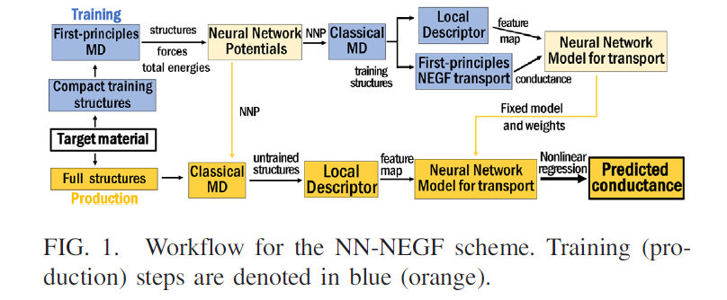
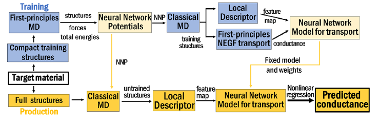
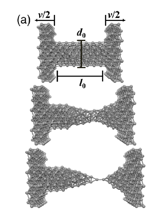
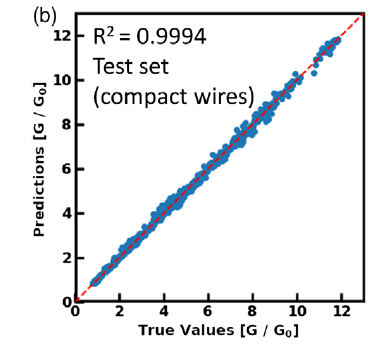
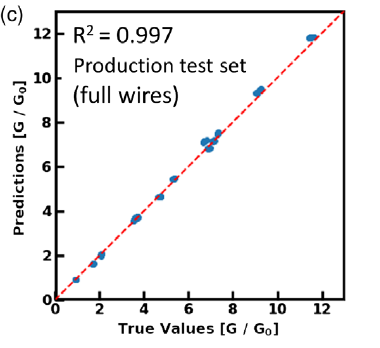
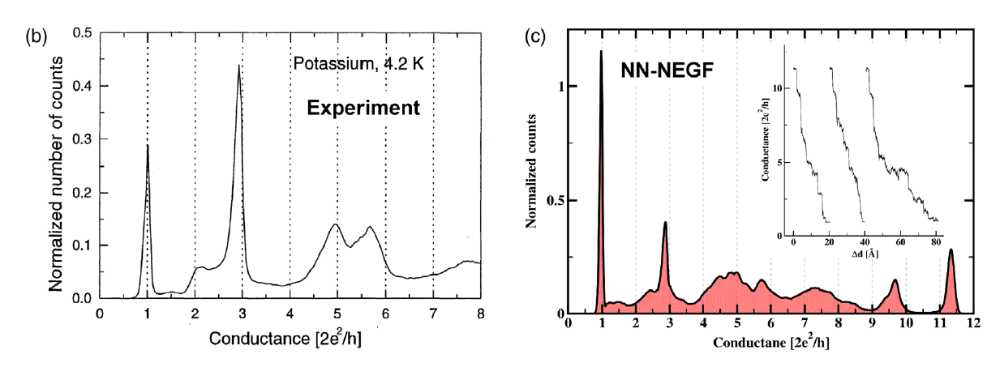
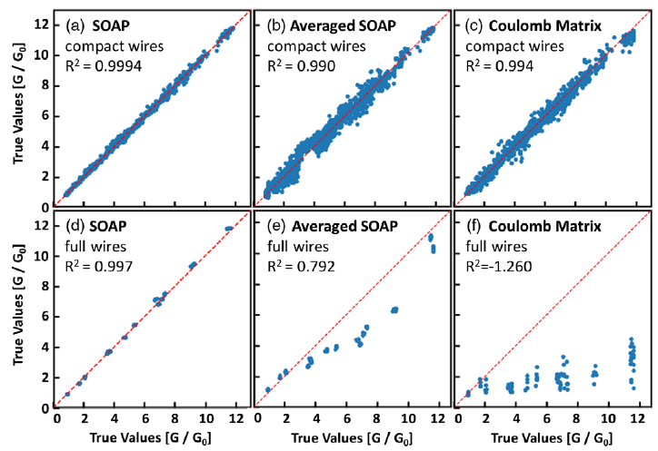

# Notes: Deep-Learning  Approach to First-Principles Transport Simulations

***这篇文章放在Endnotes中的本科毕设项目当中***

## Introduction

- 第一性原理计算受限于：由于计算的需求，对系统尺度和时间跨度的相对论性的描述还是困难的。

- 利用ML算法可以提高第一性原理计算的效率，或甚至避免一些计算量
  - Neural network potential 使得经典分子动力学模拟有了几乎是第一性原理计算的准确度，但只需要原本一部分的计算量即可
    - 见参考文献【3,4,5】
- 目前成熟的计算方法还未解决的问题：非平衡的情况，比如电子输运，目前只是在model systems的条件下进行研究：参考文献【14,15】
  - 由于第一性原理输运计算的高计算量要求，它们往往被局限在一些非常简单的系统之下
- 本篇文章的目的就是引入一个一般性的数据科学框架并结合第一性原理输运计算，使得我们能够填补简单系统和复杂性更高的实际材料间的间隙
  - 不仅利用ML加速第一性原理计算
  - 将ML作为一个更加实用的应用
  - 利用ML in twofold way（双重方式）：
    - NNP：neural network potential，从经典MD模拟中得到相对论性的结构：参考文献【5,16,17】
      - 这一方法在近些年已经被广泛用来处理传统经典力场,本文没有深入介绍
    - 利用NEGF得到的电导计算值被用来训练深度神经网络，从而在传统的第一性原理方法体系之外预测系统的输运性质
      - 这一方法还没有被应用过，因此本文主要集中于介绍这后一部分的内容

- the scheme:

- 目前的疑惑点：

  - **分子动力学模拟**的过程几乎不知道

    - First-Principles MD 和 Classical MD的区别

  - NNP：参考文献5：PRL DPMD

  - **Local descriptor**：参考文献21：on representing chemical environment

  - 神经网络的相关知识

    

## Description of NN-NEGF procedure

- local descriptor et...
- **之后再来补充这一部分**

- 此部分到第三页开头结束

  

## Assess the performance of NN-NEGF scheme

***这部分也就是要实际做的部分***

- 使用potassium(K) nanowires

  - 原因有二：1. 非平庸的电子结构和几何结构而导致的非平庸的输运性质。 2.能够在实验上和MCBJ（Mechanically controlled break junction )测量结果进行对比 

- 再次把流程图贴出来，和下面的步骤一一对应

#### Production Calculation

  ***计算细节在补充材料当中***

  - 利用从first-principle MD得到的**structure**,**total** **energy** and **forces**训练**NNP**s: 参考文献【55】

  - NNPs的训练：采用DeepPot-SE model:参考文献【17】

  - 利用训练好的NNPs，模拟了MCBJ中钾原子线的伸长过程

    - consider compact wire geometries to train the NN
    - $l_0 = 3.5$nm, $d_0 = 1.75$nm
    - 57 sets with different initial velocities and temperatures, as well as different stretching speeds $v$ between 5 to 20 m/s
    - the maximum final length is $7.6$ nm
    - 以上是相关参数。伸长线会形成一个narrow constriction 直到单原子链的形成：
    - 从以上57个伸长组当中，在每个组当中截取大约200个snapshots $\Rightarrow$共有114085个结构
      - 值得注意的是，和实验结果类似，我们只在线没有断裂的时候take snapshots并且不考虑隧穿效应。因为隧穿效应带来的输运太小了(conductance $\ll 1G_0 = 2e^2/h$  )
      - 这11408个structures是以SOAP descriptor表示的
      - SOAP的特点：
        - 每个原子的特征的数量$N_F$是独立于总原子数量$N_A$的
        - $N_F$ is fixed by the choice of the number of $n_r$ radial and  $n_l$ angular functions used to construct the power spectrum

  - 将11408个结构分别代入first-principle NEGF 当中计算每个结构的电导值

  - 训练神经网络：

    - 特征：the descriptor representation of the structures(这里用的是SOAP)

      - 这里$n_r = 17 ,n_l= 9$，从而确定了$N_F = 1530$ features per atom。

    - 目标数据：conductance values

    - 训练过程：

      - 数据随机分配：

        - **training** set: 8213 structures

        - **validation** set: 912 structures

        - **test** set: 2283 structures

          

      - 用测试集评价NN的能力：**the true conductance** against **the predict conductance** values of the test data set

  - 将网络训练好之后，我们将其用来模拟实际的感兴趣的实验当中，这是检验网络有效性的方式。实验来自于参考文献【54】

    - 因为需要和实验结合，有一些特别注意：

      1. 实验中的线比我们用来训练的线要长的多，因此在production calculations 中 the full geometries must be chosen according to the experiment.
      2. 为了负荷试验，我们在接下来的模拟当中要考虑的线的初始长度为~$6.3$nm，初始半径为~$1.75$nm, 最大的拉伸长度为~$17.5$nm
      3. All the MD simulations are performed at the same temperature **4.5K** , as in the experiments
      4. the used stretching speed is 10 m/s：这对于实验来说是很大的速度，但是仍然很小，能够满足线的relaxation and reequilibration。

    - 模拟过程：

      1. test the reliability of the NN with regard to these experimentally relevant wires:

         - 证明了能够准确地从小的训练体系拓展到更大的、在production calculation中的体系

         - 计算了一个较小的生成测试集（full wires）：

           - 这个较小的生成集当中包含100个结构，线长度从**6.3**-**17.5nm**，比训练时用到的线的长度的两倍还多
           - NN在测试结果当中发挥的很好：

         - 评价：尽管NN的训练结果是很好的，但它是基于NEGF的数据的基础上训练得到的，并不是通过直接从实验中的数据得到的。因此NN的预测结果只能做到和NEGF一样好的程度。

           **因此**，我们非常有必要和实验对照着看，观察是否在我们NN-NEGF的体系当中我们真正地捕捉到了所有输运相关的物理

      2. 直接将NN的预测结果和实验结果进行对比：

         - 实验的histograms往往是由成千上万的数据构成的，而直接运用第一性原理的NEGF的巨大计算量是不可能实现这么多数据的预测的。因此，我们必须通过NN-NEGF的框架进行。
         - 根据步骤，模拟了400个电导曲线，每一条由350-1500个数据点组成，总共有大约200000个独立电导值组成。这些数据相应的电导直方图由上面的c所示。
         - 对比模拟的得到的直方图c和实验数据b，我们可以发现二者很相似。接下来我们分析这两张图的异同点：
           - 首先是一个知识：高电导对应的情况是短线和大半径；低电导对应的情况是长线和小半径，在极端情况下就是单原子半径（原子点接触或是单原子线的情况）
           - 对比两张图可以发现，除了$1G_0$处的peak明显不同外，在其它方面都是很相似的($R^2 \approx 0.997$)
           - 关于$1G_0$处的解释：是由于拉伸速度过快导致的
             - the stretching speed in the simulations $v=10$m/s is larger than in experiment, but much smaller than the speed of sound $2000$m/s in potassium, allowing the wire to reequilibrate between successive instabilities.
             - For monatomic chains, too high $v$ may suppress collective relaxations and overestimate the length of monatomic chains, thus overeastimating the peak height at 1 $G_0$
             - 这一观点可以通过不同的速度下测试来说明：在不同速度拉伸之下，主要是$1G_0$处的peak的高度被影响，其他位置的特征依旧符合。

      3. 改变用于神经网络训练过程中的训练集和测试集，发现**learning** **curve**仅变化很小。这说明了NN-NEGF scheme的可靠性很高，能够实现在较小的体系中训练然后预测更复杂的体系的情况。

      4. 最后讨论了descriptor的问题。上面是使用local descriptors,改用global descriptors。

         - 选用了两种global descriptors: average SOAP and Coulomb matrix descriptor
         - 在训练过程中（用simple structure，即 compact wires used for training），两种global descriptors 都发挥得很好
         - 但在外推到复杂体系时(full wires used in the production calculations)，average SOAP and Coulomb matrix descriptor发挥的并不好
         - 这说明了local descriptor representation的作用：能够成功将conductance从简单、小的情况（用于训练的数据）拓展到更大的系统（the production data）当中

## Conclusion

#### Advantages

- 节省了大量的计算量，而能够达到和传统第一性原理计算相同的精度
- 步骤上很方便，可以移植到其它系统当中

#### Condition

- 面对的输运系统必须由足够的**局域机制**（local mechanisms）所主导；如果系统的输运很强地依赖于**非局域机制**（比如超交换作用superexchange,长程关联long-range correlated transport）,那么在没有进行针对非局域机制的修正的情况下，the local descriptor将不太可能capture上述的作用。
- 被用于识别最重要的关联特征的GMP（global-max-pooling）很可能失效，because the problem cannot be broken down into localized features.
  - 解决方法：Increasing the input or output size of the layers before and after the GMP layer or introducing a series of local pooling layers may help to tackle these issues.

